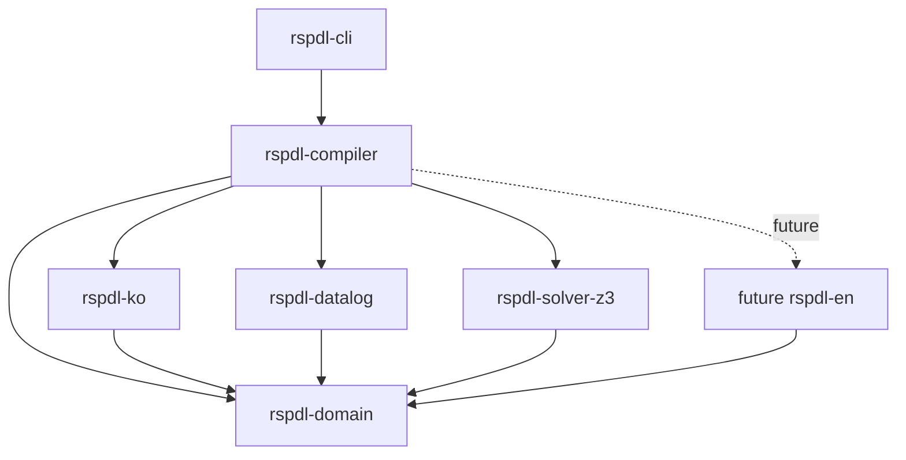
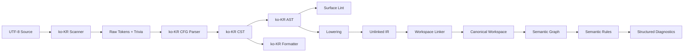

# RSPDL Compiler Architecture

## 상태와 목적

이 문서는 Proposed 상태의 구현 아키텍처다.

[Rust와 한국어 우선 독립 Locale Frontend ADR](adr/0001-rust-korean-first-frontends.md)의 결정을 코드 경계로 옮기고, 구현 전에 dependency direction과 test ownership을 합의하는 것이 목적이다.

## 아키텍처 원칙

1. Canonical Semantic IR과 구조화된 진단만 Locale 사이의 호환 계약으로 삼는다.
2. `rspdl-domain`은 한국어 조사, 영어 어순 또는 Locale AST를 알지 않는다.
3. 각 Locale frontend는 scanner부터 lowering까지 전체 표면 언어를 소유한다.
4. Compiler correctness와 표현 품질 lint를 분리한다.
5. 모든 phase output은 source provenance를 유지한다.
6. 결과 순서는 hash iteration에 의존하지 않고 명시적으로 정규화한다.
7. 공개 의미 규칙은 구현 독립적인 conformance fixture를 가진다.

## Rust workspace 구조

workspace는 frontend, semantic domain, backend와 실행 경계를 독립 crate로 유지한다.

```text
rspdl-domain/
├── Cargo.toml
├── crates/
│   ├── rspdl-domain/
│   │   ├── src/
│   │   │   ├── source/
│   │   │   ├── diagnostic/
│   │   │   ├── ir/
│   │   │   ├── workspace/
│   │   │   ├── linker/
│   │   │   ├── graph/
│   │   │   └── analysis/
│   │   └── tests/
│   ├── rspdl-ko/
│   │   ├── src/
│   │   │   ├── scanner/
│   │   │   ├── syntax/
│   │   │   ├── parser/
│   │   │   ├── ast/
│   │   │   ├── lowering/
│   │   │   ├── lint/
│   │   │   └── formatter/
│   │   └── tests/
│   ├── rspdl-compiler/
│   │   ├── src/
│   │   │   ├── frontend.rs
│   │   │   ├── pipeline.rs
│   │   │   └── session.rs
│   │   └── tests/
│   ├── rspdl-datalog/
│   ├── rspdl-solver-z3/
│   └── rspdl-cli/
│       └── src/
├── schemas/
│   ├── canonical-ir.schema.json
│   └── diagnostic.schema.json
├── conformance/
│   ├── ko-KR/
│   ├── semantic/
│   ├── cross-locale/
│   └── round-trip/
└── docs/
```

초기부터 compiler phase마다 crate를 만들지 않는다. 다만 독립 backend 또는 실행 경계가 필요한 `rspdl-datalog`, `rspdl-solver-z3`는 별도 crate로 둔다.

미래 `rspdl-en`은 `rspdl-ko`를 의존하지 않고 동일한 frontend output 계약을 구현한다.

## Dependency direction



허용하지 않는 dependency는 다음과 같다.

- `rspdl-domain -> rspdl-ko`
- `rspdl-ko -> rspdl-compiler`
- `rspdl-ko -> future rspdl-en`
- semantic rule에서 Locale token 또는 Locale message 직접 참조

## Compiler pipeline



Surface lint 진단은 lowering을 차단하지 않는다. Scanner 또는 parser의 오류가 있더라도 안전한 복구가 가능한 범위에서 CST와 복수 진단을 반환한다.

Frontend lowering 결과인 `UnlinkedIrModule`은 symbolic reference와 source provenance를 보존한다. Linker가 workspace 전체의 선언을 stable machine ID에 연결해 Canonical Workspace와 Semantic Graph를 만든다.

## Crate 책임

### `rspdl-domain`

Locale에 독립적인 compiler domain을 소유한다.

- `SourceId`, UTF-8 byte `TextRange`와 line index
- `Diagnostic`, `RuleId`, `Severity`, `MessageKey`, evidence
- unlinked IR, Canonical IR node와 stable machine ID
- module, import와 specification version
- symbol table과 name resolution
- Semantic Graph
- 타입, 데이터, 플로우와 정책 의미 규칙
- Canonical IR과 진단의 안정적인 serialization

사람에게 표시할 번역 문장은 domain diagnostic에 저장하지 않는다. Domain은 message key와 구조화된 argument를 반환한다.

초기 의미 백본은 [정규화 타입·도메인과 논리 IR 코어 RFC](rfcs/0002-typed-domains-and-logic-core.md)와 [Stratified Datalog and Typed Solver RFC](rfcs/0003-stratified-datalog-and-typed-solver.md)를 따른다. 모든 canonical value, variable, predicate와 set expression은 완전히 해석된 타입을 가지며 `Any`나 암시적 형변환을 허용하지 않는다. `rspdl-datalog`는 안전한 active-domain rules를 결정적으로 materialize하고, `rspdl-solver-z3`는 backend-neutral constraint API를 typed SMT solving으로 연결한다.

### `rspdl-ko`

Controlled Korean surface language 전체를 소유한다.

- trivia와 원문 위치를 보존하는 scanner
- grammar 위치에 따른 suffix marker 분리
- `수정할`을 Action과 `할` marker로 분리하는 action suffix 처리
- Locale CST와 AST
- handwritten recursive-descent parser와 오류 복구
- 한국어 표현 품질 lint
- 조사와 공백을 정규화하는 formatter
- `SurfaceRef`를 포함한 AST의 Canonical IR lowering
- 한국어 syntax diagnostic의 message key와 argument

형태소 분석, 품사 분석과 동의어 추론은 포함하지 않는다.

### `rspdl-compiler`

애플리케이션이 사용하는 compiler facade다.

- source workspace와 compile option 수집
- spec version과 Locale 선택
- Locale frontend 호출
- core linker와 analyzer 실행
- phase별 진단 병합과 안정적인 정렬
- partial result와 failure policy

제안하는 외부 경계는 다음과 같다.

```rust
pub struct CompileOptions {
    pub locale: Locale,
    pub spec_version: SpecVersion,
    pub surface_lints: bool,
}

pub struct Compilation {
    pub ir: Option<CanonicalWorkspace>,
    pub graph: Option<SemanticGraph>,
    pub diagnostics: Vec<Diagnostic>,
}

pub fn compile(
    sources: SourceWorkspace,
    options: CompileOptions,
) -> Compilation;
```

각 Locale crate의 CST와 AST는 공통 trait object로 강제하지 않는다. Compiler가 Locale을 선택하고, frontend는 공통 `FrontendOutput`으로 경계를 닫는다.

```rust
pub struct FrontendOutput {
    pub modules: Vec<UnlinkedIrModule>,
    pub source_map: SourceMap,
    pub diagnostics: Vec<Diagnostic>,
}
```

### `rspdl-cli`

CLI는 파일 I/O, argument parsing, 출력 format과 exit code만 담당한다. 문법 또는 의미 규칙을 포함하지 않는다.

Canonical IR을 정책표나 사용자·리소스별 조회 모델로 투영하는 기능은 compiler와 CLI의 책임이 아니다. application은 `rspdl-domain`이 직렬화한 IR과 진단을 입력으로 사용해 표시, 필터, 집계와 조회 계약을 소유한다. 자세한 경계는 [Core와 Application Projection 경계 ADR](adr/0002-core-application-boundary.md)을 따른다.

## 진단과 source provenance

모든 token과 AST node는 UTF-8 byte range를 유지한다. Line과 column은 source line index에서 표시 시 계산한다.

진단 정렬 키는 최소한 다음 순서로 고정한다.

1. `SourceId`
2. primary span 시작 offset
3. severity
4. Rule ID
5. 관련 symbol ID

Parser가 recovery node를 만들면 해당 node는 원문 span과 recovery kind를 보존한다. Lowering은 의미가 불명확한 recovery subtree를 IR로 추측하지 않는다.

## 결정론

- serialization 전 map과 set 순서를 canonical key로 정렬한다.
- diagnostics 순서를 명시적인 sort key로 정한다.
- source path는 workspace-relative canonical form으로 정규화한다.
- 현재 시각, OS Locale, thread scheduling과 hash seed를 출력에 포함하지 않는다.
- 동일한 source와 spec version은 동일한 IR과 진단을 만들어야 한다.

## 테스트 아키텍처

### Crate unit tests

`rspdl-ko`는 다음 단위를 직접 테스트한다.

- raw token과 trivia scan
- marker suffix split
- quoted identifier
- 각 grammar production
- parser recovery와 source span
- 받침 기반 비차단 lint
- formatter idempotence
- AST to IR lowering

`rspdl-domain`은 Locale source 없이 hand-authored IR fixture로 다음을 테스트한다.

- symbol resolution
- type와 schema validation
- graph construction
- 권한·데이터·플로우 교차 규칙
- diagnostic ordering
- canonical serialization

### Conformance tests

구현 독립 fixture는 repository root의 `conformance/`에 둔다.

Conformance test는 구현 내부 구조가 아니라 명세가 외부에 약속하는 Canonical IR, 의미 분석 결과와 구조화된 진단을 검증한다. Locale별 CST와 AST는 공개 호환 계약에 포함하지 않고 해당 frontend crate의 unit 또는 golden test에서 검증한다.

```text
conformance/ko-KR/policy/capability-basic/
├── case.yaml
├── input.rspdl
├── expected.ir.json
├── expected.analysis.json
└── expected.diagnostics.json
```

`case.yaml`은 spec version, Locale, 기대 성공 단계와 비교할 artifact를 선언한다.

각 공개 규칙에는 다음 사례를 요구한다.

- 정상 사례
- 실패 사례
- 경계 사례
- 유사하지만 오류가 아니어야 하는 오탐 방지 사례

Golden file은 명세 계약이므로 단순 snapshot 갱신으로 승인하지 않는다. 문법 또는 의미 변경 RFC와 같은 review에서 변경한다.

### Property와 determinism tests

- `format(format(source)) == format(source)`
- `IR(parse(format(source))) == IR(parse(source))`
- source 파일 입력 순서 변화에 결과가 동일함
- 반복 실행에서 IR bytes와 diagnostic bytes가 동일함
- parser가 임의 UTF-8 입력에서 panic하지 않음

미래 `rspdl-en`이 추가되면 동일 의미의 `ko-KR`과 `en-US` fixture가 같은 Canonical IR을 생성하는지 비교한다.

## 첫 vertical slice

첫 구현은 전체 언어를 한 번에 만들지 않고 다음 end-to-end 경로를 완성한다.

1. 한 개 source와 `ko-KR` 선택
2. Actor, Entity, Field와 Action의 최소 선언
3. 한 개 controlled Korean policy 문장
4. Locale AST와 Canonical IR lowering
5. symbol resolution
6. 존재하지 않는 symbol 진단 한 종류
7. 조사 surface lint 한 종류
8. formatter와 round-trip test
9. CLI JSON diagnostic 출력

이 vertical slice가 통과한 뒤 유저 플로우, 조건식과 정책 충돌 규칙을 확장한다.

## 구현된 vertical slice

[Korean Domain Frontend Language Specification](rfcs/0004-natural-korean-domain-grammar.md)은 다음 결정을 구현한다.

- `.rspdl` source와 `@모듈 표시 이름(stable_id)` header
- 자연어 enum·데이터 header와 들여쓰기 기반 무표식 항목
- 정확한 표시 이름 참조와 stable machine ID lowering
- 이름·source ID 없이 인식되는 자연 문장형 제약·정책과 결정적 내부 Rule ID
- Z3 제약 반례와 Datalog 정책 match 실행
- `parse`, `compile`, `check`, `format` CLI와 안정적인 JSON artifact

관계·컬렉션·유저 플로우·조건부 정책과 일반 논리식은 후속 vertical slice에서 다룬다.
