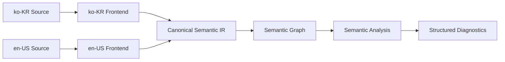

# RSPDL Language Product Requirements Document

## 1. 언어 정의

**RSPDL**은 제품 기획의 권한, 데이터 모델과 유저 플로우를 사람이 읽고 기계가 검증할 수 있게 표현하는 선언형 언어다.

사람이나 AI가 문서를 작성할 수 있지만, 문서의 의미와 유효성은 명시된 언어 명세와 결정론적 규칙으로 판정한다.

## 2. 해결할 언어 문제

- 자연어 기획서는 같은 개념을 여러 표현으로 작성해 기계적으로 해석하기 어렵다.
- 권한, 데이터와 플로우가 분리되어 영역 간 참조와 모순을 표현하기 어렵다.
- 한국어·영어 문법이 독립적으로 발전하면 같은 의미가 서로 다른 결과를 만들 수 있다.
- 구현체마다 파싱·의미 분석·진단 결과가 달라질 수 있다.
- AI가 생성한 문서의 의미를 AI 판단에 의존하지 않고 재현 가능하게 검증해야 한다.

## 3. 언어 목표

1. 권한·데이터 모델·유저 플로우를 하나의 의미 체계로 표현한다.
2. 한국어·영어 등 서로 다른 표면 문법을 공통 의미 모델로 변환한다.
3. 사람에게 읽기 쉬우면서 모호하지 않은 구조화된 문법을 제공한다.
4. 안정적인 기계 ID로 문서와 Locale 사이의 참조를 연결한다.
5. 의미 오류와 교차 영역 모순을 구조화된 진단으로 설명한다.
6. 모든 호환 구현체가 동일한 입력에서 동일한 의미 결과를 만들게 한다.

## 4. 언어 원칙

1. **의미가 표준이다.** 표면 문법보다 Canonical Semantic IR을 호환성의 기준으로 삼는다.
2. **Locale은 표현 계층이다.** Locale은 문법·어순·키워드·메시지를 담당하고 의미 규칙을 바꾸지 않는다.
3. **명시성을 우선한다.** 편의보다 해석의 단일성과 오류의 조기 발견을 우선한다.
4. **참조와 표시를 분리한다.** 번역 가능한 이름과 안정적인 기계 ID를 구분한다.
5. **검증은 결정론적이다.** 같은 입력과 명세 버전은 같은 IR과 진단을 생성한다.
6. **진단은 추적 가능하다.** 오류는 Rule ID, 원문 위치, 관련 심볼과 근거를 제공한다.
7. **AI는 특별한 작성자가 아니다.** AI 출력도 동일한 파싱·의미 분석·검증을 통과한다.

## 5. 언어 계층

- **CST:** 주석, 공백, 토큰과 원문 위치를 보존한다.
- **AST:** Locale별 문법 구조를 표현한다.
- **Canonical Semantic IR:** 안정적인 ID, 타입, 참조와 조건을 표현한다.
- **Semantic Graph:** 권한·데이터·액션·화면·상태 전이의 관계를 연결한다.
- **Diagnostic:** 구현체와 표시 언어에 독립적인 오류 계약을 제공한다.

CST와 AST는 Locale마다 달라도 되지만, Canonical IR과 진단의 의미는 같아야 한다.

## 6. 핵심 의미 영역

### 권한

`Actor`, `Role`, `Permission`, `Policy`, `Resource`, `Action`, `Condition`

### 데이터 모델

`Entity`, `Field`, `Relation`, `Constraint`, `State`

### 유저 플로우

`Screen`, `UserAction`, `Transition`, `Flow`, `Condition`

### 교차 관계

- 역할은 조건에 따라 리소스 액션을 허용하거나 금지한다.
- 화면의 액션은 권한을 요구하고 엔티티를 읽거나 변경한다.
- 액션은 상태 전이를 발생시키고 필드 제약을 충족해야 한다.
- 플로우는 시작점, 도달 가능성, 종료 조건과 수행 가능한 역할을 가진다.

## 7. 언어 요구사항

| ID | 요구사항 |
| --- | --- |
| `SYNTAX-001` | 초기 문법은 자유 자연어가 아닌 구조화된 블록 형식이어야 한다. |
| `LOCALE-001` | 같은 의미의 Locale 문서는 정규화 후 동일한 Canonical IR을 생성해야 한다. |
| `LOCALE-002` | 표시 이름은 번역할 수 있지만 선언과 참조는 안정적인 기계 ID를 사용해야 한다. |
| `MODULE-001` | 여러 문서와 Locale에 걸쳐 심볼을 선언·참조·연결할 수 있어야 한다. |
| `SEM-001` | 권한·데이터·플로우의 타입, 참조와 조건을 의미 분석할 수 있어야 한다. |
| `SEM-002` | 세 영역을 하나의 Semantic Graph에서 연결하고 교차 모순을 표현할 수 있어야 한다. |
| `DIAG-001` | 문법 오류와 의미 오류를 구분하고 정확한 원문 위치를 반환해야 한다. |
| `DIAG-002` | 진단은 Rule ID, 심각도, message key, 관련 심볼과 근거를 구조화해야 한다. |
| `COMPAT-001` | 호환 구현체는 공통 Conformance Test Suite로 의미 동등성을 증명해야 한다. |
| `VERSION-001` | 문서는 사용한 언어 명세와 필요한 의미 규칙 버전을 선언할 수 있어야 한다. |

## 8. 초기 언어 범위

### 포함

- 구조화된 블록 문법
- `ko-KR`, `en-US` 표면 문법
- 모듈, 선언, 안정적인 ID와 교차 문서 참조
- 권한, 데이터 모델, 유저 플로우의 핵심 타입
- 조건식, 상태 전이와 영역 간 관계
- Canonical Semantic IR과 Diagnostic schema
- Locale 간 의미 동등성 규칙
- 핵심 의미 오류와 교차 모순의 진단 계약

### 제외

- 자유 형식 자연어의 직접 해석
- 자연어 문서에서 사실을 추측하는 AI 의미 판정
- 특정 UI·IDE·MCP·플랫폼의 기능
- 특정 프로그래밍 언어의 API와 패키지 구조
- 시각화와 애플리케이션 코드 생성

## 9. 적합성 기준

언어 적합성 테스트는 구현 기술과 독립적인 입력·기대 결과로 배포한다.

- 문법상 유효하거나 유효하지 않은 입력
- Source에서 기대 CST/AST 또는 구문 진단으로의 변환
- Locale별 Source에서 공통 Canonical IR로의 변환
- 여러 Locale 모듈 사이의 심볼 연결
- 기대 Semantic Graph와 구조화된 진단
- 정상·실패·경계·오탐 방지 규칙 사례
- 포매팅 후 의미가 유지되는 round-trip 사례

출력 텍스트는 번역될 수 있지만 Rule ID, 심각도, 관련 심볼과 의미 위치는 동등해야 한다.

## 10. 성공 기준

- 모든 다국어 fixture가 의미상 동일한 Canonical IR을 생성한다.
- 모든 호환 구현체가 동일한 IR과 구조화된 진단을 생성한다.
- 모든 공개 의미 규칙에 정상·실패·오탐 방지 사례가 존재한다.
- 같은 명세 버전에서 파싱·링킹·의미 분석 결과를 재현할 수 있다.
- 대표 시나리오에서 권한·데이터·플로우 내부 오류와 교차 모순을 함께 표현한다.
- 신규 Locale을 추가해도 기존 의미 명세와 규칙을 변경하지 않는다.

## 11. 명세 및 문서 관리

- RSPDL 명세는 SemVer를 따르며 `0.1.0`부터 시작한다.
- MAJOR는 호환되지 않는 문법·의미 변경, MINOR는 호환 가능한 기능 추가, PATCH는 의미를 바꾸지 않는 정정에 사용한다.
- 릴리스된 명세, Canonical IR과 Diagnostic schema는 수정하지 않고 새 버전으로 변경한다.
- 문법·의미·호환성에 영향을 주는 변경은 RFC와 Conformance fixture를 함께 요구한다.
- 승인된 RFC는 사소한 정정 외에는 수정하지 않고 새 RFC가 이전 결정을 `supersedes`한다.
- 개발 명세는 `current`, 릴리스 명세는 Git tag의 불변 스냅샷으로 관리한다.
- PRD Draft는 `0.x`, 최초 승인은 `1.0`으로 표시하며 큰 범위 변경에만 리비전을 올린다.

## 12. 미결정 언어 사항

- RSPDL의 정식 풀네임과 파일 확장자
- 구체적인 문법과 예약어
- 사용자 정의 refinement, 추가 primitive와 조건식 연산의 표현 범위
- 모듈·import·버전 선언 문법
- 정책 충돌 시 우선순위와 평가 의미
- core semantic rule과 확장 rulepack의 경계
- Locale 추가와 표준 채택 절차

## 참고 기준

- [Semantic Versioning 2.0.0](https://semver.org/)
- [Rust RFC process](https://rust-lang.github.io/rfcs/)
