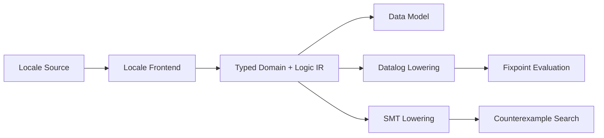

# 정규화 타입·도메인과 논리 IR 코어

## 상태와 목적

이 RFC는 Proposed 상태다.

RSPDL의 데이터 선언, 파생 규칙, 정책, 상태 전이와 무결성 제약이 공유하는 Locale 독립적 의미 백본을 정의한다. 이 백본은 이후 Datalog 고정점 평가기와 SMT 반례 검증기의 공통 입력이 된다.

## 핵심 결정

### 모든 값에는 하나의 정규화 타입이 있다

Canonical IR에는 `Any`, 추론 중인 타입, 암시적 union 또는 자동 형변환이 없다. 모든 값, 변수, predicate parameter와 set expression은 완전히 해석된 `CanonicalType`을 가진다.

초기 canonical type은 다음과 같다.

- `boolean`
- 수학적 무한 정수인 `integer`
- 유한하지 않은 UTF-8 문자열 집합인 `string`
- stable machine ID와 닫힌 variant 집합을 가진 `enum`
- 기반 타입과 내장 predicate를 가진 `refinement`

표시 이름과 번역 가능한 문자열은 타입 동일성에 참여하지 않는다. Stable ID와 구조가 같은 타입만 동일하다.

### 값 표현도 정규화한다

정수는 구현체의 `i64` 범위가 아니라 임의 정밀도 수학적 정수로 저장한다. 직렬화할 때 base-10 문자열 하나만 허용한다.

```text
0
42
-42
```

`+42`, `042`, `-0`은 같은 값을 여러 byte 표현으로 만들기 때문에 canonical 입력으로 허용하지 않는다.

Enum value는 선언된 variant만 가질 수 있다. Refinement value는 생성 시 predicate를 통과해야 한다. 잘못된 값은 backend까지 전달하지 않는다.

## 도메인

Domain은 한 canonical type이 가질 수 있는 값의 집합이다.

### 유한 도메인

유한 도메인은 값을 명시적으로 저장한다.

```text
ExpenseStatus = {draft, submitted, approved}
```

- 모든 원소의 canonical type이 같아야 한다.
- 중복은 제거한다.
- 원소 순서는 canonical value 순서로 정규화한다.
- 빈 집합도 명시적인 원소 타입을 가져야 한다.

### 계산 가능한 무한 도메인

초기 내장 무한 도메인은 다음과 같다.

| Domain | Value type | Ground membership | Enumeration |
| --- | --- | --- | --- |
| integers | `integer` | exact | unsupported |
| strings | `string` | exact | unsupported |
| primes | `prime(integer)` | exact | unsupported |

무한 도메인은 열거하지 않는다. 구체적인 canonical value가 도메인에 속하는지만 결정적으로 계산한다.

### Prime은 refinement다

소수는 별도 primitive가 아니라 `integer`에 `prime` predicate를 적용한 refinement type이다.

```text
prime(integer)
```

구체적인 정수가 소수인지는 정확하게 판정할 수 있다. 그러나 일반 SMT의 표준 integer theory가 primality predicate에 대한 완전한 symbolic reasoning을 제공하는 것은 아니다. 따라서 현재 capability는 다음과 같다.

- ground value validation: exact
- finite materialization을 사용한 Datalog: 가능
- 무한 prime domain 전체에 대한 Datalog evaluation: finite grounding 필요
- prime predicate에 대한 SMT symbolic reasoning: unsupported

지원하지 않는 backend가 prime을 정수로 근사해 잘못된 `SAT` 또는 `UNSAT`을 반환해서는 안 된다.

## 계산 능력 계약

각 Domain은 다음 정보를 제공한다.

- `cardinality`: `Finite(n)` 또는 `CountablyInfinite`
- `enumeration`: 정확한 열거 가능 여부
- `ground_membership`: 구체적인 값의 소속 판정 수준
- backend별 `symbolic_support`

`symbolic_support`는 다음 셋 중 하나다.

- `Exact`: 의미 손실 없이 lowering 가능
- `RequiresFiniteGrounding`: 유한한 active domain이 추가로 있어야 가능
- `Unsupported`: 현재 backend 계약으로는 정확하게 표현할 수 없음

이 정보는 최적화 힌트가 아니라 correctness gate다.

## 타입이 있는 집합 대수

초기 Set IR은 다음을 표현한다.

```text
Domain
Literal
Union
Intersection
Difference
```

모든 operand는 같은 canonical type이어야 한다. 암시적 승격은 없다.

Union과 Intersection은 결합법칙과 교환법칙에 따라 중첩 operand를 펼치고 정렬하며 중복을 제거한다. 따라서 작성 순서가 다른 동등한 입력은 같은 canonical structure와 serialization을 만든다.

Difference는 교환법칙이 성립하지 않으므로 operand 순서를 보존한다.

## 공유 논리 IR

Datalog rule body, 정책 조건과 무결성 제약은 다음 최소 IR을 공유한다.

### Term

- typed variable
- typed canonical constant

### Atom

- 같은 타입 term 사이의 equality
- term과 같은 타입 set 사이의 membership
- typed predicate application

Predicate application은 signature의 arity와 parameter type을 생성 시 검증한다.

### Boolean expression

- literal
- atom
- `and`
- `or`
- `not`

`and`와 `or`는 operand를 펼치고 정렬하며 중복을 제거한다. `not`은 별도 node로 유지하여 이후 열린 세계/닫힌 세계와 negation semantics를 명시적으로 결정할 수 있게 한다.

이 RFC는 “증명 실패에 의한 부정”을 논리적 부정으로 취급한다고 결정하지 않는다.

## Datalog와 SMT의 경계

이 코어는 Datalog나 SMT solver 자체가 아니다.



Datalog lowering은 range restriction, finite grounding, recursion과 stratified negation을 추가로 검증해야 한다. SMT lowering은 사용된 domain, predicate와 연산마다 theory support를 확인해야 한다.

## 의도적으로 결정하지 않은 사항

- 사용자 정의 refinement predicate 문법과 안전한 실행 방식
- refinement 사이의 명시적 subtype/cast 문법
- 실수, decimal, timestamp, duration과 byte sequence
- Unicode normalization form
- Datalog의 열린 세계/닫힌 세계 및 negation semantics
- SMT solver 선택과 supported theory profile
- 무한 문자열에 대한 정규식과 문자열 연산 범위
- 데이터 선언의 Controlled Korean 표면 문법

## 적합성 요구사항

- 다른 canonical type 사이의 값 비교와 집합 연산은 실패해야 한다.
- 유한 도메인의 중복 제거와 순서는 입력 순서와 무관해야 한다.
- prime 경계값과 큰 ground value 사례를 검사해야 한다.
- backend가 지원하지 않는 symbolic domain을 사전에 식별해야 한다.
- 같은 의미의 commutative expression은 같은 canonical serialization을 만들어야 한다.
- 실패는 panic이나 묵시적 coercion이 아니라 구조화된 construction error여야 한다.

