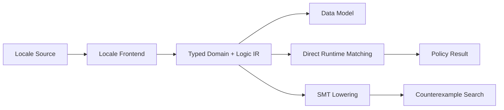

# 정규화 타입·도메인과 논리 IR 코어

## 상태와 목적

이 RFC는 Proposed 상태다.

RSPDL의 데이터 선언, 파생 규칙, 정책, 상태 전이와 무결성 제약이 공유하는 Locale 독립적 의미 백본을 정의한다. 이 백본은 직접 runtime 정책 매칭과 SMT 반례 검증의 공통 입력이 된다.

## 핵심 결정

### 모든 값에는 하나의 정규화 타입이 있다

Canonical IR에는 `Any`, 추론 중인 타입, 암시적 union 또는 자동 형변환이 없다. 모든 값, 변수, predicate parameter와 set expression은 완전히 해석된 `CanonicalType`을 가진다.

초기 canonical type은 다음과 같다.

- `boolean`
- 수학적 무한 정수인 `integer`
- 유한 소수 표기를 정확히 보존하는 임의 정밀도 `decimal`
- 유한하지 않은 UTF-8 문자열 집합인 `string`
- 달력 날짜인 `date`
- 날짜와 시간대가 없는 하루 안의 시각인 `time`
- UTC instant인 `date_time`
- 달력 월·년과 구분되는 고정 나노초 기간인 `duration`
- 범위가 각각 `[-90, 90]`, `[-180, 180]`인 `latitude`, `longitude`
- stable machine ID와 닫힌 variant 집합을 가진 `enum`
- 기반 타입과 내장 predicate를 가진 `refinement`

표시 이름과 번역 가능한 문자열은 타입 동일성에 참여하지 않는다. Stable ID와 구조가 같은 타입만 동일하다.

### 값 표현도 정규화한다

정수는 구현체의 `i64` 범위가 아니라 임의 정밀도 수학적 정수로 저장한다. 직렬화할 때 base-10 문자열 하나만 허용한다.

```text
0
42
-42
```

`+42`, `042`, `-0`은 같은 값을 여러 byte 표현으로 만들기 때문에 canonical 입력으로 허용하지 않는다.

Enum value는 선언된 variant만 가질 수 있다. Refinement value는 생성 시 predicate를 통과해야 한다. 잘못된 값은 backend까지 전달하지 않는다.

확장 scalar의 canonical representation은 다음과 같다.

| Type | Canonical value | Notes |
| --- | --- | --- |
| `decimal` | `-12.5`, `0`, `42` | exponent와 `+`는 허용하지 않고 선행·후행 0은 정규화한다. |
| `date` | `2026-08-13` | proleptic Gregorian calendar의 `0001-01-01`부터 `9999-12-31`까지다. |
| `time` | `14:30:00.125` | `00:00:00` 이상 `24:00:00` 미만이며 소수 초는 나노초 정밀도다. |
| `date_time` | `2026-08-13T05:30:00Z` | RFC 3339 입력을 UTC `Z` representation으로 정규화한다. |
| `duration` | `-PT1.5S`, `PT0S` | signed fixed duration이다. calendar month/year duration은 허용하지 않는다. |
| `latitude` | `37.5665` | decimal 의미와 `[-90, 90]` 범위 검사를 함께 적용한다. |
| `longitude` | `126.978` | decimal 의미와 `[-180, 180]` 범위 검사를 함께 적용한다. |

모호한 local date-time을 instant로 추측하지 않는다. `date_time`은 offset이 있는 RFC 3339 입력만 받고 UTC로 정규화한다. 별도 `local_date_time`과 `zoned_date_time`은 아래 product-value contract를 따른다.

### 타입별 연산

모든 canonical type은 같은 타입끼리 equality와 inequality를 지원한다. 순서 연산 `<`, `<=`, `>`, `>=`은 `integer`, `decimal`, `date`, `time`, `date_time`, `local_date_time`, `zoned_date_time`, `duration`, `money`, `percentage`, compatible `quantity`, `latitude`, `longitude`에 정의한다. `string`, `boolean`, `enum`, `refinement`에 순서 연산을 적용하면 construction 또는 type-check 단계에서 실패한다.

`date`/`time`/`date_time`/`local_date_time`/`zoned_date_time`, `duration`, money, percentage, compatible quantity, decimal 및 위도·경도의 대소는 type-specific ordered comparison으로 정규화한다. money/percentage/quantity의 exact add/subtract, calendar date application, coordinate distance/radius는 아래 contract로 제공한다. 일반 산술식과 GIS topology는 지원하지 않는다.

### 제품 값 타입 vertical slice

Issue #20의 `data-lifecycle-modeling-gap`을 줄이기 위해 다음 closed vocabulary를 `CanonicalType` parameter로 보존한다. `money(KRW)`와 `money(USD)`, `quantity(mass)`와 `quantity(length)`, `reference(module.model)`은 서로 다른 타입이며 같은 숫자나 문자열이라도 비교할 수 없다.

- `money(ISO-4217 uppercase code)`는 canonical `"<decimal> <code>"` literal을 쓴다. 같은 통화끼리의 비교·덧셈·뺄셈만 exact하며 환율과 환산은 없다.
- `percentage`는 canonical `<decimal>%`이고 decimal storage가 아닌 percentage 표시 의미를 보존한다. 덧셈·뺄셈과 비교는 exact다. 한국어 `비율`은 같은 의미 타입의 별칭이며, core의 exact conversion은 ratio `0.15`를 `15%`로 바꾸고 다시 `0.15`로 복원한다. `%` 없는 bare field literal을 임의로 percentage로 해석하지 않는다.
- `quantity(mass|length|duration)`는 현재 `kg/g`, `m/km`, `s/ms`의 닫힌 단위 vocabulary만 쓴다. **type identity에는 dimension**, canonical value에는 **정확히 변환한 base-unit 값과 unit**이 보존된다(`1000 g`와 `1 kg`은 canonical `1 kg`). 따라서 같은 dimension 안에서만 exact comparison·덧셈·뺄셈하고, `20 kg`와 `20 km`는 type mismatch다.
- `coordinate`는 `latitude,longitude` 하나의 원자 값이다. 각 축 범위를 함께 검사하며 아래 Haversine/within-radius contract를 쓴다.
- `uuid`, `email`, `url`, `phone_number`, `ip_address`, `cidr`, `country_code`, `language_code`, `currency_code`는 network/DNS 없이 결정적으로 형식을 검사한다. country/language/currency는 live registry membership가 아니라 명세된 lexical form만 검사한다.
- `list(T)`, `set(T)`, `map(K,V)`, `reference(model-id)`는 parameter를 type identity에 포함한다. set은 duplicate를 거부하고 canonical value 순서로 직렬화한다. map은 deterministic JSON key ordering을 쓰며 structured/collection key는 허용하지 않는다.

한국어 frontend는 `통화(KRW)`, `백분율`, `수량(kg)`, `좌표`, `UUID`, `이메일`, `URL`, `CIDR`, `집합(문자열)`, `목록(T)`, `맵(K, V)`, `참조(model)`의 field type을 lower한다. quoted literal constraints와 runtime JSON binding은 money, percentage, quantity, coordinate, refinement 및 list/set/map을 검증한다.

`지역 날짜시간`은 offset 없는 ISO local calendar tuple이며 tuple order를 쓴다. `시간대 날짜시간`은 `<RFC3339 explicit offset> <IANA zone>` input만 받고, pinned `chrono-tz 0.10.4` IANA data가 해당 instant에서 준 offset과 반드시 일치해야 한다. 그러므로 fall-back ambiguity는 명시 offset으로 선택되고 nonexistent local time 또는 mismatched offset은 거부한다; order는 instant 기준이다. `달력 기간`은 `P[nY][nM][nD]`를 고정 duration으로 바꾸지 않고 월을 년으로 정규화한다(`P12M` = `P1Y`). Date 적용의 `RejectOverflow` 정책은 `2026-01-31 + P1M`을 error로 만든다.

Coordinate distance는 pinned pure-Rust `libm 0.2.15`의 mean Earth radius `6,371,008.8 m` 고정 Haversine으로 계산하고 결과를 metre quantity로 소수점 아래 9자리 반올림한다. `within-radius`는 non-negative length quantity만 받는다. 이는 deterministic algorithm/rounding contract의 approximate API이며 GIS/topology proof가 아니다. CIDR은 host bit를 network address로 masking해 one canonical form으로 직렬화하고 IPv4/IPv6 containment를 exact bit operation으로 판정한다.

## 도메인

Domain은 한 canonical type이 가질 수 있는 값의 집합이다.

### 유한 도메인

유한 도메인은 값을 명시적으로 저장한다.

```text
ExpenseStatus = {draft, submitted, approved}
```

- 모든 원소의 canonical type이 같아야 한다.
- 중복은 제거한다.
- 원소 순서는 canonical value 순서로 정규화한다.
- 빈 집합도 명시적인 원소 타입을 가져야 한다.

### 계산 가능한 무한 도메인

초기 내장 무한 도메인은 다음과 같다.

| Domain | Value type | Ground membership | Enumeration |
| --- | --- | --- | --- |
| integers | `integer` | exact | unsupported |
| strings | `string` | exact | unsupported |
| primes | `prime(integer)` | exact | unsupported |

확장 scalar는 concrete value validation, equality와 ordered ground comparison이 exact다. 현재 SMT symbolic domain에는 자동으로 승격하지 않으며 finite active domain 없이 사용하는 backend는 `Unsupported`를 반환해야 한다.

무한 도메인은 열거하지 않는다. 구체적인 canonical value가 도메인에 속하는지만 결정적으로 계산한다.

### Prime은 refinement다

소수는 별도 primitive가 아니라 `integer`에 `prime` predicate를 적용한 refinement type이다.

```text
prime(integer)
```

구체적인 정수가 소수인지는 정확하게 판정할 수 있다. 그러나 일반 SMT의 표준 integer theory가 primality predicate에 대한 완전한 symbolic reasoning을 제공하는 것은 아니다. 따라서 현재 capability는 다음과 같다.

- ground value validation: exact
- prime predicate에 대한 SMT symbolic reasoning: unsupported

지원하지 않는 backend가 prime을 정수로 근사해 잘못된 `SAT` 또는 `UNSAT`을 반환해서는 안 된다.

## 계산 능력 계약

각 Domain은 다음 정보를 제공한다.

- `cardinality`: `Finite(n)` 또는 `CountablyInfinite`
- `enumeration`: 정확한 열거 가능 여부
- `ground_membership`: 구체적인 값의 소속 판정 수준
- backend별 `symbolic_support`

`symbolic_support`는 다음 셋 중 하나다.

- `Exact`: 의미 손실 없이 lowering 가능
- `RequiresFiniteGrounding`: 유한한 active domain이 추가로 있어야 가능
- `Unsupported`: 현재 backend 계약으로는 정확하게 표현할 수 없음

이 정보는 최적화 힌트가 아니라 correctness gate다.

## 타입이 있는 집합 대수

초기 Set IR은 다음을 표현한다.

```text
Domain
Literal
Union
Intersection
Difference
```

모든 operand는 같은 canonical type이어야 한다. 암시적 승격은 없다.

Union과 Intersection은 결합법칙과 교환법칙에 따라 중첩 operand를 펼치고 정렬하며 중복을 제거한다. 따라서 작성 순서가 다른 동등한 입력은 같은 canonical structure와 serialization을 만든다.

Difference는 교환법칙이 성립하지 않으므로 operand 순서를 보존한다.

## 공유 논리 IR

정책 조건과 무결성 제약은 다음 최소 IR을 공유한다.

### Term

- typed variable
- typed canonical constant

### Atom

- 같은 타입 term 사이의 equality
- ordered canonical type의 같은 타입 term 사이 comparison
- term과 같은 타입 set 사이의 membership
- typed predicate application

Predicate application은 signature의 arity와 parameter type을 생성 시 검증한다.

### Boolean expression

- literal
- atom
- `and`
- `or`
- `not`

`and`와 `or`는 operand를 펼치고 정렬하며 중복을 제거한다. `not`은 별도 node로 유지하여 이후 열린 세계/닫힌 세계와 negation semantics를 명시적으로 결정할 수 있게 한다.

이 RFC는 “증명 실패에 의한 부정”을 논리적 부정으로 취급한다고 결정하지 않는다.

### Entity relation과 bounded quantification

Record model은 bounded relational analysis에서 entity sort로 사용된다. Relation은 정렬된 model parameter signature와 stable ID를 가진 Boolean predicate다. 값의 복사 횟수를 세는 `Bag -> count`는 기본 데이터 의미가 아니다. 같은 tuple의 중복은 relation의 set semantics에서 존재하지 않으며, 서로 다른 domain object는 가상 atom 또는 실제 record ID로 구분한다.

현재 공유 `BooleanExpression`은 quantifier-free다. `required`, `unique`, `nonempty`, `exclusive`, `exhaustive`는 [Finite Relational Rules and Bounded Model Finding RFC](0007-finite-relational-model-finding.md)에 정의된 1차 논리 schema이고, 지정된 finite scope에서 conjunction/disjunction으로 grounding된 뒤 이 Boolean IR에 들어간다. 따라서 범용 quantifier node를 구현한 것처럼 표현하지 않으며, scope 안의 `UNSAT`도 unbounded proof로 승격하지 않는다.

`coexistent`는 논리적으로 overlap을 강제하는 existential assertion이 아니라 함께 참이어도 compatible하다는 제품 의미 metadata다. Solver는 선언되지 않은 compatibility, totality와 cardinality를 스스로 만들지 않는다.

## 직접 매칭과 SMT의 경계

이 코어는 runtime matcher나 SMT solver 자체가 아니다.



현재 runtime matcher는 선언된 무조건 allow/deny 정책과 action request 및 role assignment를 직접 대조한다. SMT lowering은 사용된 domain, predicate와 연산마다 theory support를 확인해야 한다.

## 의도적으로 결정하지 않은 사항

- 사용자 정의 refinement predicate 문법과 안전한 실행 방식
- refinement 사이의 명시적 subtype/cast 문법
- IEEE 부동소수점 실수
- 환율과 사용자 정의 단위
- GIS polygon/topology와 geocoding
- byte sequence
- Unicode normalization form
- 재귀적 관계 폐쇄가 필요할 때의 별도 evaluation model
- SMT solver 선택과 supported theory profile
- 무한 문자열에 대한 정규식과 문자열 연산 범위
- 데이터 선언의 Controlled Korean 표면 문법

## 적합성 요구사항

- 다른 canonical type 사이의 값 비교와 집합 연산은 실패해야 한다.
- 유한 도메인의 중복 제거와 순서는 입력 순서와 무관해야 한다.
- prime 경계값과 큰 ground value 사례를 검사해야 한다.
- backend가 지원하지 않는 symbolic domain을 사전에 식별해야 한다.
- 같은 의미의 commutative expression은 같은 canonical serialization을 만들어야 한다.
- 실패는 panic이나 묵시적 coercion이 아니라 구조화된 construction error여야 한다.
